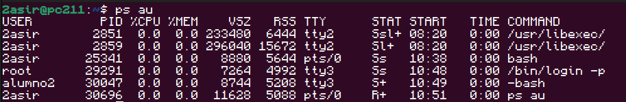
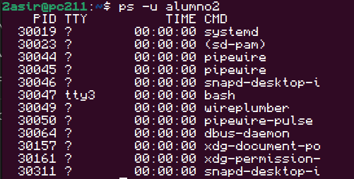
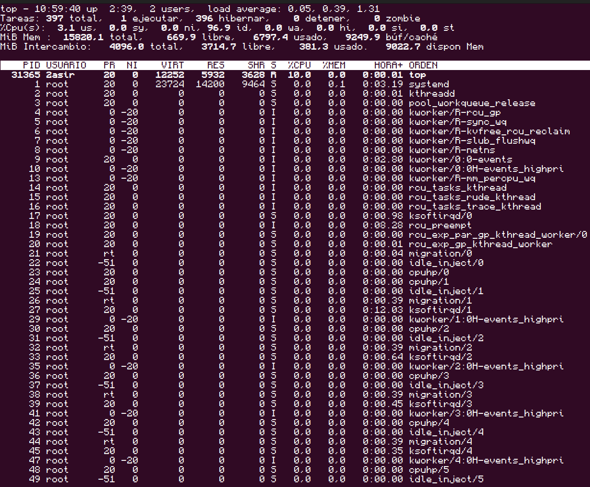
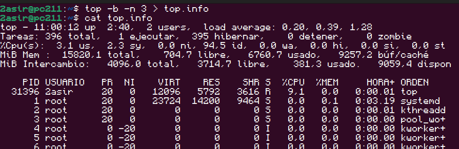
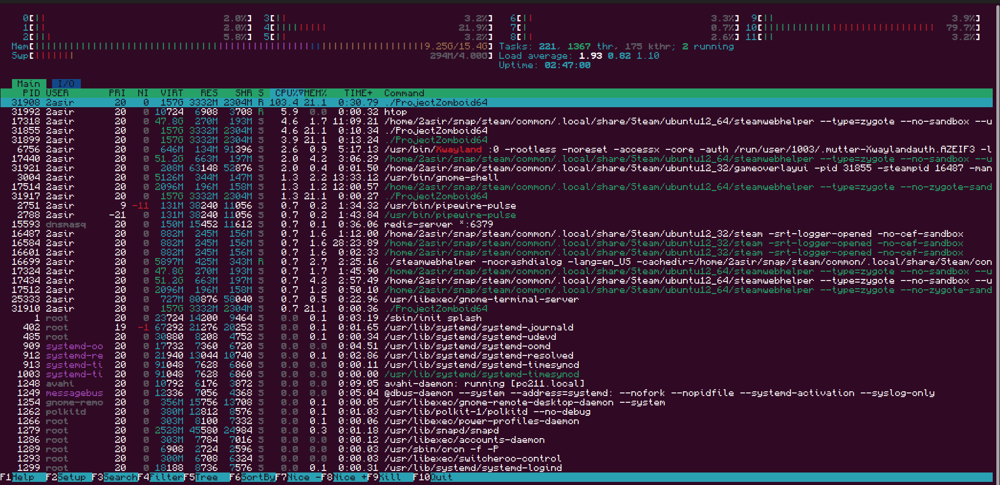
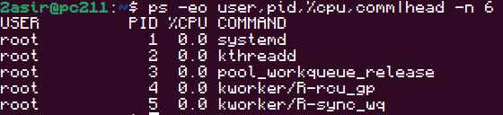

# COMANDOS 

## 🛠️Comando 1: Muestra procesos con formato extendido
```bash
ps au
```


---

## 🛠️Comando 2: Muestra todos los procesos con detalles
```bash
ps aux
```


---

## 🛠️Comando 3: Muestra procesos de un usuario específico
```bash
ps -u nombre_usuario
```


---

## 🛠️Comando 4: Visualización interactiva de procesos
```bash
top
```


---

## 🛠️Comando 5: Ejecuta top en modo batch y muestra 3 actualizaciones consecutivas de los procesos.
```bash
top -b -n 3
```


---

## 🛠️Comando 6: Muestra un monitor interactivo de procesos con información en tiempo real.
```bash
htop
```


---

## 🛠️Comando 7: Lista los 6 primeros procesos mostrando usuario, PID, uso de CPU y comando.
```bash
ps -eo user,pid,%cpu,comm | head -n 6
```


---

[](../)

## 🛠️Comando 8: 

for i in {1..2};do yes > /dev/null & done (para hacer el script)
luego sudo kill -9 PID 


