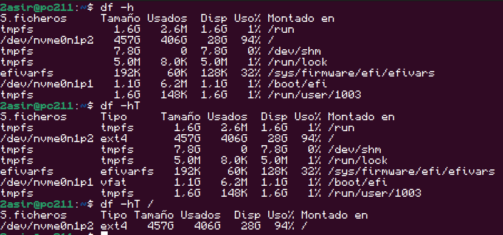
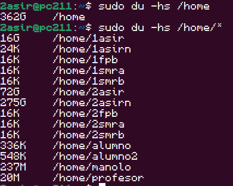
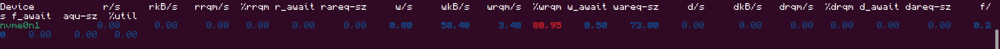

# Memoria, espacio y rendimiento de disco 

## 🛠️Comando 1: 
```bash
free
```
```bash
free -h
```
```bash
free -s 3
```


## 🛠️Comando 2: 
```bash
df -h
```
```bash
df -hT
```
```bash
df -h /
```


## 🛠️Comando 3: 
```bash
du -h /home
```
```bash
df -h /home/*
```


## 🛠️Comando 4: 
```bash
iostat -x nombre_disco 5
```


[](../)


