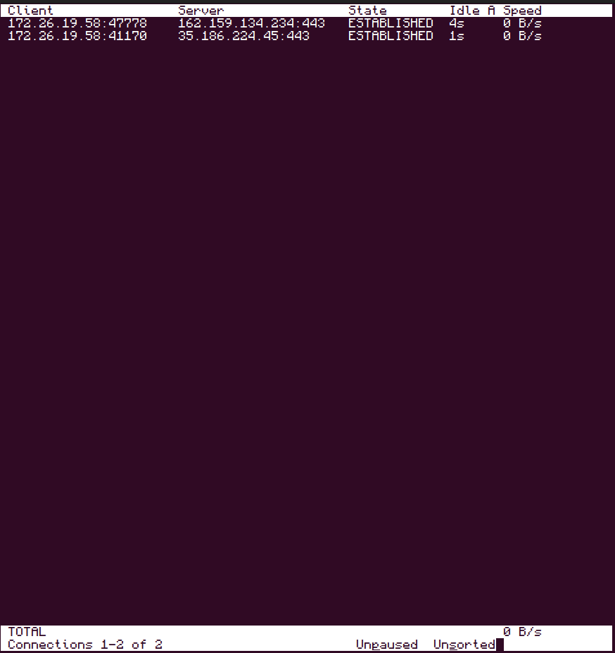
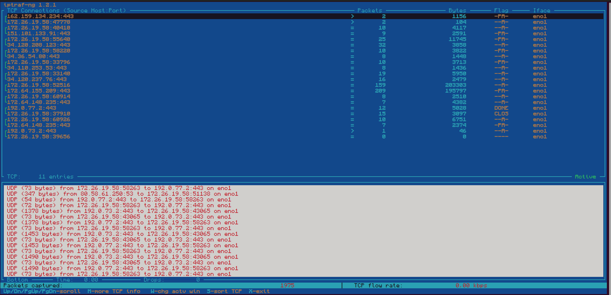
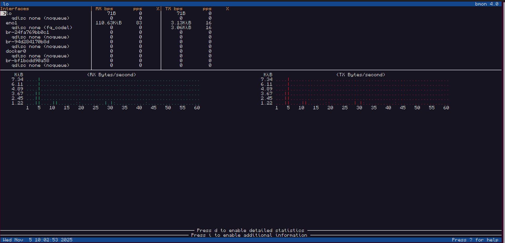

# Tráfico de red  

## 🛠️Comando 1: Analizador de paquetes CLI que captura tráfico en modo promiscuo, permitiendo la inspección profunda de cabeceras y payloads para auditoría de red y troubleshooting.
```bash
sudo tcdump
```


---

## 🛠️Comando 2: Sniffer pasivo que monitoriza el estado de las sesiones TCP en una interfaz, desglosando el ancho de banda por conexión individual.
```bash
tcptrack -i [TARJETA_DE_RED]
```


---

## 🛠️Comando 3: Utilidad basada en la librería ncurses que genera estadísticas granulares de tráfico IP/TCP/UDP en tiempo real, incluyendo conteo de bytes y flag de paquetes.
```bash
iptraf
```


---

## 🛠️Comando 4: Monitor de ancho de banda y estimador de tasas de transferencia que visualiza la carga y saturación de las interfaces mediante gráficos ASCII y estadísticas de capa 2.
```bash
bmon
```


---

[](../)
