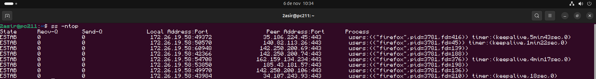
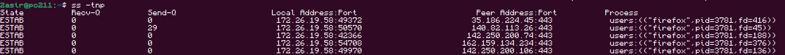
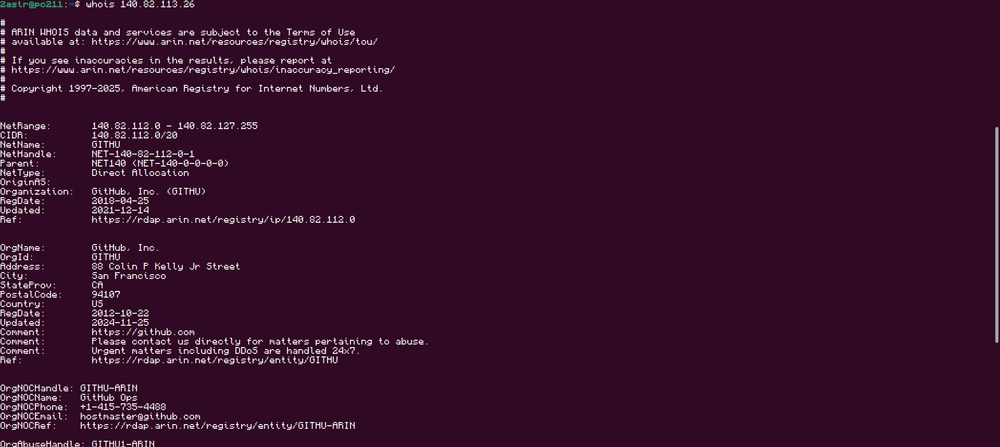
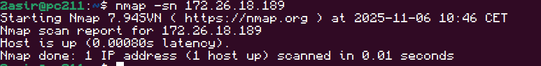
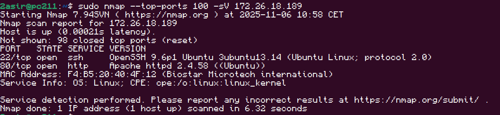
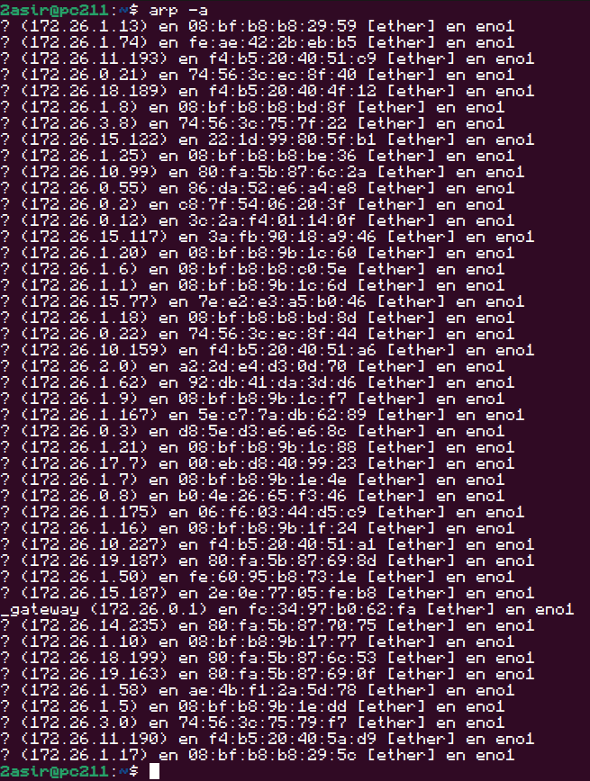

# Red y servicios 

## 🛠️Comando 1: Muestra las conexiones TCP activas usando direcciones numéricas, detallando qué proceso las usa y sus temporizadores internos.
```bash
ss -ntop
```


---

## 🛠️Comando 2: Lista de forma simple las conexiones TCP establecidas con IPs numéricas y el proceso responsable, sin mostrar los temporizadores.
```bash
ss -tnp
```


---

## 🛠️Comando 3: Consulta la base de datos pública para identificar al dueño de esa IP y sus datos de registro.
```bash
whois [IP]
```


---

## 🛠️Comando 4: Comprueba rápidamente si ese equipo está encendido (ping scan) sin intentar escanear sus puertos.
```bash
nmap -sn [IP]
```


---

## 🛠️Comando 5: Analiza los 100 puertos más comunes del objetivo para detectar qué servicios y versiones exactas están corriendo.
```bash
sudo nmap --top-ports 100 -sV [IP]
```


---

## 🛠️Comando 6: Muestra la tabla actual que relaciona las direcciones IP de tu red con sus correspondientes direcciones físicas (MAC).
```bash
arp -a
```


---

[](../)
